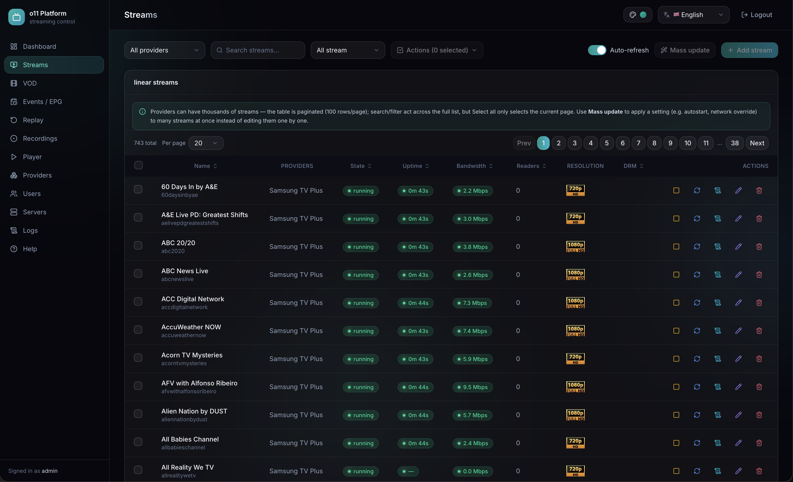

# O11 Platform



Tested on **Ubuntu 20.04 → 26.04 (Linux/AMD64)**.

> **Recommended:** use **Ubuntu 24.04 LTS** for the best stability — it is the latest long-term-support release and is well tested with `nginx`, `fail2ban`, and `ufw`, which this toolset relies on.

## Requirements

- Ubuntu 24.04 LTS (recommended), `root` or `sudo` access
- A domain/IP directly reachable by the server
- Open port: `8234` (Web UI/stream)

## Installation

```sh
sudo apt update && sudo apt upgrade -y
sudo apt install -y curl wget
curl -fsSL https://github.com/xtreamui-pro/install-repo/raw/refs/heads/main/install.sh | sudo -E bash -
```

The script automatically installs and configures: `nginx` (reverse proxy), `fail2ban`, `ufw`, `redis-server`, `ffmpeg`, and the `o11.service` systemd unit.

## Web UI

```
http://YOUR_IP:8234
Username: admin
Password: 1
```

> Change the default password immediately after your first login.

## IP Whitelist (protect against false fail2ban bans)

IPs listed in [ips.txt](ips.txt) are added to fail2ban's `ignoreip` — they will **never be banned**, even after repeated failed requests. All other IPs continue to work normally and remain subject to automatic banning if they violate a jail's rules.

1. Edit `ips.txt`, one IP or CIDR per line (lines starting with `#` are ignored):
   ```
   203.0.113.10
   198.51.100.0/24
   ```
2. Apply the change:
   ```sh
   make whitelist
   ```

## Managing fail2ban (via Makefile)

| Command                               | Description                                  |
| ------------------------------------- | -------------------------------------------- |
| `make fail2ban-status`                | Show the status of all jails                 |
| `make fail2ban-status-jail JAIL=sshd` | Show the status of a specific jail           |
| `make fail2ban-unban IP=1.2.3.4`      | Unban a single IP                            |
| `make fail2ban-unban-all`             | Unban all IPs                                |
| `make whitelist`                      | Refresh the never-ban IP list from `ips.txt` |

## Standalone fail2ban + nginx setup (when o11 is already running)

If `o11` is already installed and running on `127.0.0.1:8283` (not via `install.sh`), use [fail2ban.sh](fail2ban.sh) to set up just the `nginx` reverse proxy + `fail2ban`:

```sh
curl -fsSL https://github.com/xtreamui-pro/install-repo/raw/refs/heads/main/fail2ban.sh | sudo -E bash -
```

## Fixing permission issues (if any)

```sh
chown -R o11:o11 /home/o11
chown -R o11:o11 /mnt/hls
chown -R o11:o11 /mnt/dl
rm /home/o11/o11.log
```

## System cleanup

```sh
make clean-system
```

---

## 💖 Support Future Development

If you find these scripts useful, consider supporting the project:

| 💰 Currency                 | 📋 Address                                    |
| --------------------------- | --------------------------------------------- |
| ₿ **BTC** (Bitcoin)         | `bc1qr0s6dv4rvh245wax2kwdwyv8rz8radlfnquc7k`  |
| ⟠ **ETH** (Ethereum)        | `0x58d8b821dE46D61d9d1034313919d5370F4A8E88`  |
| ◎ **SOL** (Solana)          | `gG1VLq8GFXMqPu2mNXkHHk1535MHg66pQVh8QYz5krj` |
| 💵 **USDT** (Tether on ETH) | `0x58d8b821dE46D61d9d1034313919d5370F4A8E88`  |

---

<p align="center">
  ⭐ Star this repo if you find it helpful!<br/>
  Made with ❤️ by <a href="https://xtream-ui.pro">XtreamUI Pro</a>
</p>
